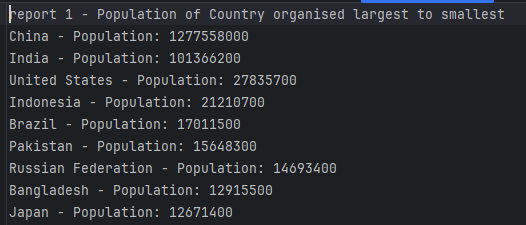
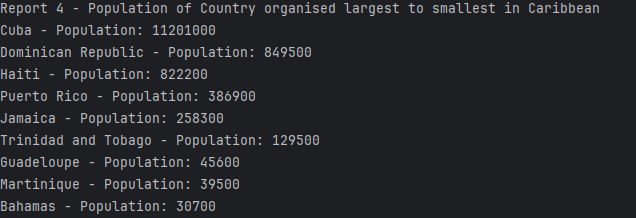
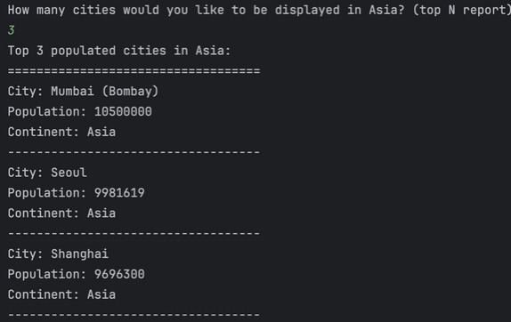
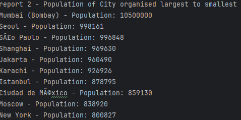
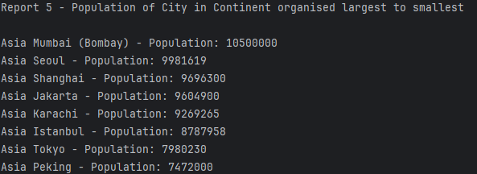
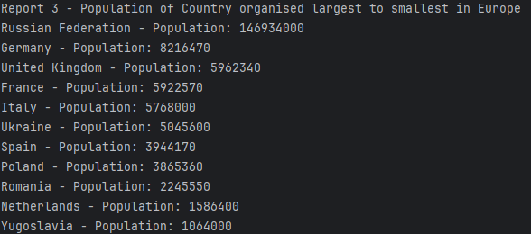

# Software Engineering Methods
* Master Build Status 
* Develop Branch Status 
* License 
* Release 

5 requirements out of 32 have been implemented which is 19%

| ID  | Name                                                                                                                                                                                  | Met | Screenshot |
|-----|---------------------------------------------------------------------------------------------------------------------------------------------------------------------------------------|-----|--|
| 1   | All the countries in the world organised by largest population to smallest.                                                                                                           | yes |       |
| 2   | Provide the number of people who speak the following languages from greatest to smallest including the percentage of the world population:  Chinese  English  Hindi  Spanish  Arabic  | no  |  |
| 3   | All the countries in a region organised by largest population to smallest.                                                                                                            | yes |  |
| 4   | The top N populated countries in the world where N is provided by the user.                                                                                                           | no  |  |
| 5   | The top N populated countries in a continent where N is provided by the user.                                                                                                         | yes |  |
| 6   | The top N populated countries in a region where N is provided by the user.                                                                                                            | no  |  |
| 7   | All the cities in the world organised by largest population to smallest.                                                                                                              | yes |   |
| 8   | All the cities in a continent organised by largest population to smallest.                                                                                                            | yes |   |
| 9   | All the cities in a region organised by largest population to smallest.                                                                                                               | no  |  |
| 10  | All the cities in a country organised by largest population to smallest.                                                                                                              | no  |  |
| 11  | All the cities in a district organised by largest population to smallest.                                                                                                             | no  |  |
| 12  | The top N populated cities in the world where N is provided by the user.                                                                                                              | no  |  |
| 13  | The top N populated cities in a continent where N is provided by the user.                                                                                                            | no  |  |
| 14  | The top N populated cities in a region where N is provided by the user.                                                                                                               | no  |  |
| 15  | The top N populated cities in a country where N is provided by the user.                                                                                                              | no  |  |
| 16  | The top N populated cities in a district where N is provided by the user.                                                                                                             | no  |  |
| 17  | All the capital cities in the world organised by largest population to smallest.                                                                                                      | no  |  |
| 18  | All the capital cities in a continent organised by largest population to smallest.                                                                                                    | no  |  |
| 19  | All the capital cities in a region organised by largest to smallest.                                                                                                                  | no  |  |
| 20  | The top N populated capital cities in the world where N is provided by the user.                                                                                                      | no  |  |
| 21  | The top N populated capital cities in a continent where N is provided by the user.                                                                                                    | no  |  |
| 22  | The top N populated capital cities in a region where N is provided by the user.                                                                                                       | no  |  |
| 23  | The population of people, people living in cities, and people not living in cities in each continent.                                                                                 | no  |  |
| 24  | The population of people, people living in cities, and people not living in cities in each region.                                                                                    | bo  |  |
| 25  | The population of people, people living in cities, and people not living in cities in each region.                                                                                    | no  |  |
| 26  | The population of people, people living in cities, and people not living in cities in each country.                                                                                   | no  |  |
| 27  | The population of the world.                                                                                                                                                          | no  |  |
| 28  | The population of a continent.                                                                                                                                                        | no  |  |
| 29  | The population of a region.                                                                                                                                                           | no  |  |
| 30  | The population of a country.                                                                                                                                                          | no  |  |
| 31  | The population of a district.                                                                                                                                                         | no  |  |
| 32  | The population of a city.                                                                                                                                                             | no  |  |
| 33  | All the countries in a continent organised by largest population to smallest.                                                                                                         | yes |   |

